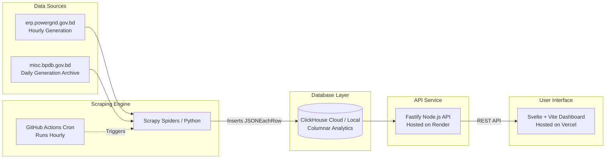

#  Bangladesh Power Grid Live Monitor (PowerGrid-BD)

[](https://svelte.dev/)
[](https://fastify.dev/)
[](https://clickhouse.com/)
[](https://scrapy.org/)
[](LICENSE)

An enterprise-grade, real-time national power grid monitoring and statistical analytics dashboard for Bangladesh. The platform continuously ingests, structures, and visualizes hourly and daily generation telemetry from **Power Grid Bangladesh PLC (PGCB)** and **Bangladesh Power Development Board (BPDB)**.

Designed with a modern, clutter-free **Material Design 3** interface, responsive visualizations, automated loadshedding risk assessments, and dark mode support.

---

##  Key Features

### 1.  Real-Time Grid Monitoring
- **Live Generation Curve**: 24-hour continuous generation tracking with hourly resolution.
- **Dynamic Fuel Overlays**: Segmented view of real-time electricity output across **Natural Gas**, **Coal**, **Liquid Fuel (HFO/HSD)**, **Hydro**, **Solar**, and **Wind**.
- **Day vs. Evening Peak Indicators**: Automated identification and marking of daily system peak demand events.

### 2.  Cross-Border Electricity Imports
- Tracks cross-border interconnector transfers into Bangladesh:
  - **Adani Godda (Jharkhand)**: 1,600 MW dedicated transmission line
  - **Bheramara HVDC (West Bengal)**: 500 kV Back-to-Back HVDC Station
  - **Tripura / Cumilla**: 400 kV Synchronous AC link
  - **Nepal Hydro**: Trilateral cross-border electricity trade via Indian grid

### 3.  Power Plants Explorer & Fleet Registry
- **Searchable & Filterable Table**: Comprehensive inventory of power stations across Bangladesh (e.g., Payra, Rampal, Matarbari, Bibiyana, Ghorashal, Sirajganj, Ashuganj, Haripur, Meghnaghat).
- **Regional Filtering**: Filter by division/area (Dhaka, Chattogram, Khulna, Rajshahi, Barishal, Sylhet, Rangpur, Comilla, Mymensingh).
- **Operational Health Tags**:
  - 🟢 **Optimal**: Operating near declared present capacity.
  - 🟡 **Derated**: Running at partial load due to fuel constraints or minor defects.
  - 🔴 **Offline / Outage**: Zero MW generation with detailed breakdown of root causes.

### 4.  Loadshedding & Outage Command Center
- **Automated Grid Stress Meter**: Real-time stress ratio calculation comparing current generation against operational capacity.
- **Dynamic Risk Categorization**:
  - **Stable**: Generation adequately meeting demand with healthy operating reserve.
  - **Moderate Stress**: Elevated grid load approaching spinning reserve margins.
  - **Critical Risk**: Generation deficit triggering localized or regional load shedding.
- **Outage Driver Breakdown**: Root-cause analysis of unavailable capacity (Gas shortage/low pressure, scheduled boiler overhauls, turbine maintenance, transformer faults).
- **Unavailable Capacity Split**: Planned Maintenance (MW) vs. Forced Emergency Shutdowns (MW).

### 5.  30-Day Historical Trends & Analytics
- Multi-week time-series tracking evening peak demand vs. actual generation.
- Historical unserved energy (MKWHr) and loadshedding deficit curves.
- System averages: 30-day average peak generation, demand averages, and cumulative energy supplied.

### 6.  Regional Zonal Distribution
- Division-by-division stacked energy generation analysis (MKWHr) tracking how much power is produced across each administrative region.

### 7.  Modern Minimal UI & UX
- Material Design 3 expressive color palette with automatic and manual **Dark / Light Mode**.
- Smooth Chart.js animations, glassmorphism headers, and mobile-friendly responsive layout.
- High-resilience architecture: backend serves realistic seed fallback data if the database is cold or syncing, ensuring zero downtime.

---

##  System Architecture



---

##  Tech Stack

| Component | Technology | Purpose |
| :--- | :--- | :--- |
| **Frontend** | [Svelte](https://svelte.dev/) + [Vite](https://vitejs.dev/) | Reactive, ultra-lightweight client-side dashboard |
| **Data Viz** | [Chart.js](https://www.chartjs.org/) + `svelte-chartjs` | Responsive line, bar, horizontal bar, and doughnut charts |
| **Icons & Fonts** | Google Material Symbols + Inter | Modern typography and minimal materialistic icon set |
| **Backend** | [Fastify](https://fastify.dev/) (Node.js) | High-throughput, low-latency REST API gateway |
| **Database** | [ClickHouse](https://clickhouse.com/) | Real-time columnar OLAP database for fast aggregation |
| **Web Scraper** | [Scrapy](https://scrapy.org/) (Python 3) | Robust HTML table parsing & data extraction pipeline |
| **Automation** | GitHub Actions | Scheduled hourly scraping without dedicated server costs |

---

##  Project Structure

```
electricity-live-monitor/
├── .github/
│   └── workflows/
│       └── scrape.yml            # Hourly GitHub Actions cron scraper
├── backend/
│   ├── package.json              # Fastify dependencies
│   └── server.js                 # Fastify REST API & ClickHouse integration
├── frontend/
│   ├── index.html                # HTML entry point with Material Symbols & fonts
│   ├── package.json              # Svelte & Chart.js dependencies
│   ├── vite.config.js            # Vite bundler configuration
│   └── src/
│       ├── app.css               # Material 3 CSS variables & Dark Mode styling
│       ├── App.svelte            # Main multi-tab dashboard component
│       └── main.js               # Svelte mount point
├── scraper/
│   ├── pgcb_scraper/
│   │   ├── pipelines.py          # ClickHouse HTTP insert pipeline
│   │   ├── settings.py           # Scrapy settings
│   │   └── spiders/
│   │       ├── bpdb.py           # BPDB daily generation & plant capacity spider
│   │       └── pgcb.py           # PGCB hourly generation & fuel mix spider
│   ├── requirements.txt          # Python dependencies (Scrapy, requests)
│   ├── run_all.py                # Standalone master scraper runner script
│   └── scrapy.cfg                # Scrapy configuration
├── docker-compose.yml            # Local ClickHouse setup
├── .gitignore                    # Git ignore rules
└── README.md                     # Project documentation
```

---

##  Getting Started Locally

### Prerequisites
- **Node.js** (v18 or higher)
- **Python** (v3.9 or higher)
- **Docker & Docker Compose** (for local ClickHouse, optional if using ClickHouse Cloud)

---

### 1. Database Setup (ClickHouse)
Start a local ClickHouse container:
```bash
docker-compose up -d
```
*ClickHouse HTTP interface will be available at `http://localhost:8123`.*

---

### 2. Scraper Setup & Initial Ingestion
```bash
cd scraper
python -m venv venv

# On Windows:
.\venv\Scripts\activate
# On Linux/macOS:
source venv/bin/activate

pip install -r requirements.txt

# Run the master scraper to populate the database:
python run_all.py
```

---

### 3. Backend Setup (Fastify)
```bash
cd ../backend
npm install
npm start
```
*The API will start listening on `http://localhost:3000`.*

---

### 4. Frontend Setup (Svelte)
```bash
cd ../frontend
npm install
npm run dev
```
*Visit `http://localhost:5173` in your browser to view the live dashboard.*

---

## 🌐 Production Deployment Guide

### A. Managed Database: [ClickHouse Cloud](https://clickhouse.com/cloud)
1. Create a free ClickHouse Cloud service.
2. Note your **Host URL**, **Username** (`default`), and **Password**.

### B. Backend: [Render](https://render.com/)
1. Create a new **Web Service** connected to your GitHub repository.
2. Configure settings:
   - **Root Directory**: `backend`
   - **Build Command**: `npm install`
   - **Start Command**: `npm start`
3. Add Environment Variables:
   - `CLICKHOUSE_URL`: `https://your-instance.clickhouse.cloud:8443`
   - `CLICKHOUSE_USER`: `default`
   - `CLICKHOUSE_PASSWORD`: `your-password`
   - `CLICKHOUSE_DB`: `powergrid`

### C. Frontend: [Vercel](https://vercel.com/)
1. Import the repository on Vercel.
2. Configure settings:
   - **Root Directory**: `frontend`
   - **Framework Preset**: `Vite` or `Svelte`
3. Add Environment Variable:
   - `VITE_API_URL`: `https://your-backend.onrender.com` *(no trailing slash)*
4. Click **Deploy**.

### D. Automated Scraping: [GitHub Actions](https://github.com/features/actions)
In your GitHub repository, navigate to **Settings** > **Secrets and variables** > **Actions** and add:
- `CLICKHOUSE_URL`
- `CLICKHOUSE_PASSWORD`

The `.github/workflows/scrape.yml` workflow will automatically run every hour to keep your database updated!

---

##  API Reference

| Endpoint | Method | Description |
| :--- | :--- | :--- |
| `/api/overview` | `GET` | High-level KPIs, current day summary, 30-day trends, and totals |
| `/api/hourly` | `GET` | Hourly generation curve (24–72h) with Gas, Coal, Liquid Fuel, and Imports |
| `/api/plants` | `GET` | Power plant registry with filters (`?area=Dhaka`, `?search=Payra`, `?sortBy=capacity`) |
| `/api/fuel-mix` | `GET` | Active fuel mix breakdown and percentages |
| `/api/imports` | `GET` | Cross-border interconnector details and peak flows |
| `/api/outages` | `GET` | Root-cause outage statistics and unavailable capacity |
| `/api/zones` | `GET` | Regional generation across administrative divisions |
| `/api/health` | `GET` | System and database connectivity check |

---

##  Data Sources & Attribution
- [Power Grid Bangladesh PLC (PGCB)](https://erp.powergrid.gov.bd/w/generations/view_generations) — Hourly national generation data.
- [Bangladesh Power Development Board (BPDB)](https://misc.bpdb.gov.bd/daily-generation) — Daily generation archives, plant capacities, and operational status reports.

---

## 📄 License
This project is open-source and available under the [MIT License](LICENSE).
